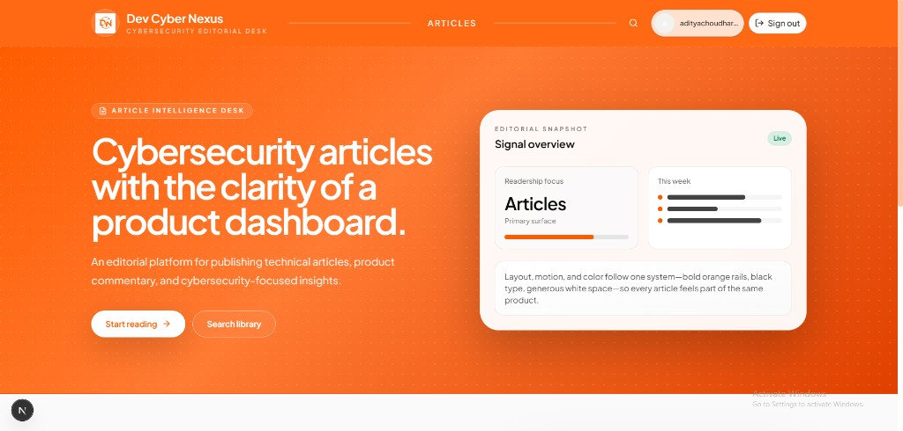
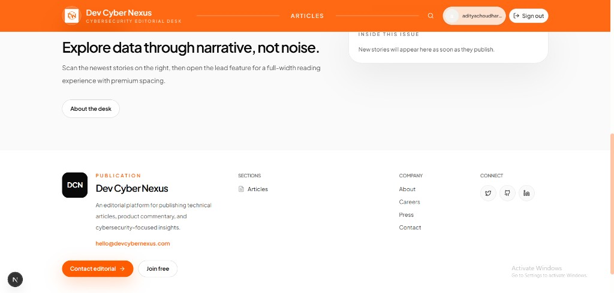
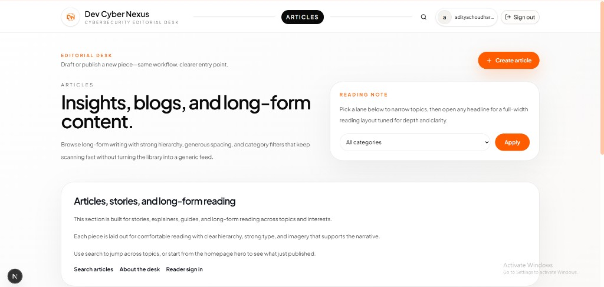
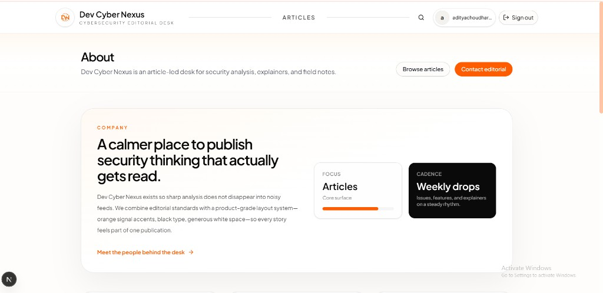
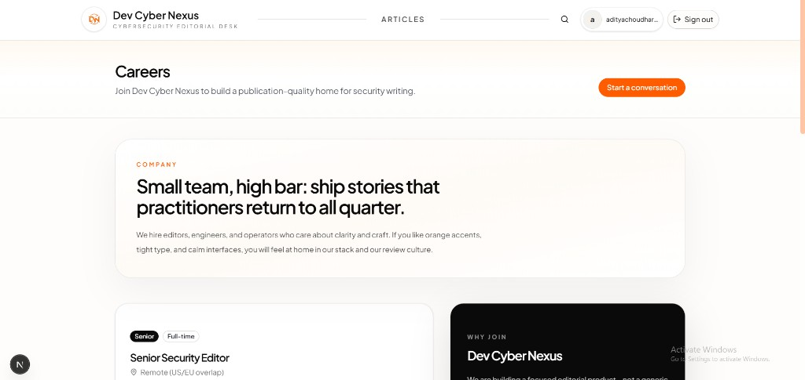

# Dev Cyber Nexus

Editorial site for cybersecurity articles and technical analysis. Built on the shared site factory (Next.js).

## UI screenshots

Images are stored in-repo under [`docs/readme/ui/`](docs/readme/ui/) so they render directly on GitHub.

### Home — hero

### Home — editorial band and footer

### Articles listing

### About

### Careers

---

For setup and deployment, see [`deploy/README.md`](deploy/README.md) and [`SITE_SETUP_CHECKLIST.md`](SITE_SETUP_CHECKLIST.md).
